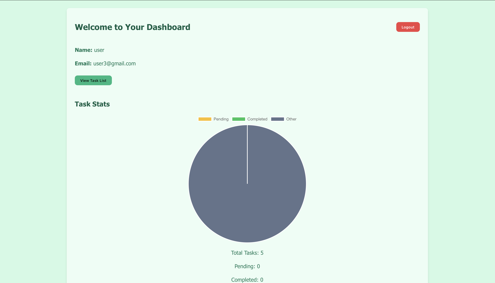
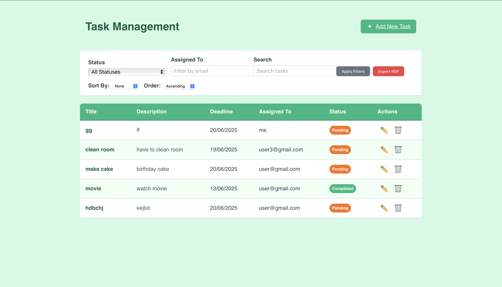
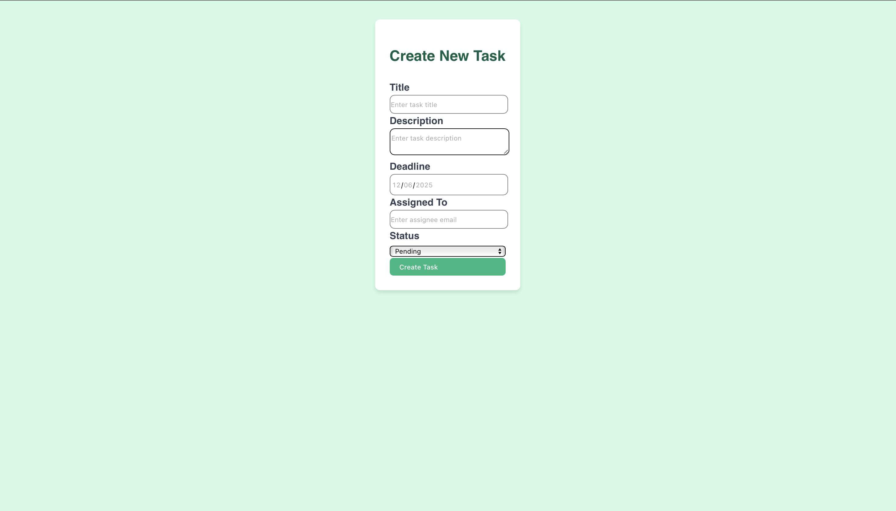

# 📝 Task Manager WebApp

A full-stack task management app built in 24 hours as part of the internship challenge. Users can create, update, and track tasks by status — with a real-time visual overview via a pie chart.


## 📂 Project Structure

task-manager/
├── backend/ # Node.js + Express + MongoDB
├── frontend/ # React + Chart.js + Tailwind CSS
└── env_files.zip


---

## ✨ Features

- 🔐 JWT-based Authentication (Login / Register)
- ➕ Create / Edit / Delete Tasks
- 📊 Pie Chart of Task Stats (Pending / In Progress / Completed)
- 📱 Responsive Dashboard UI
- 📁 Role-based routing and secure APIs

---

## 💻 Tech Stack

- **Frontend:** React, Tailwind CSS, Chart.js
- **Backend:** Node.js, Express, MongoDB, Mongoose
- **Others:** JWT, React Router, Vite, Chart.js

---

## 🧠 AI Tool Usage

AI tools (ChatGPT) were used to:
- Debug React and Chart.js integration
- Optimize state management logic
- Generate clean component structures
- Create efficient async fetch functions

> Clearly marked suggestions from AI were integrated only after validation and testing.

---

## 🛠️ Getting Started

### 🔧 Requirements
- Node.js
- MongoDB
- Vite

---

## 🔑 Setup Instructions

### Backend Setup

```bash
cd backend
npm install
# Add your .env file (see env_files.zip)
npm run dev
```
### frontend set up
```
cd frontend
npm install
# Add your .env file (see env_files.zip)
npm run dev
```
## 🖼️ Screenshots

### Dashboard View



### Task List


### Task Form



